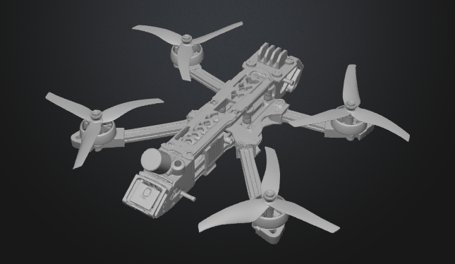

### Newton-Euler Equations

The dynamics are defined in the body-fixed frame $B$. The state vector is:
$$\mathbf{x} = [\mathbf{P}_I, \ \mathbf{V}_I, \ \mathbf{q}, \ \dot{\boldsymbol{\omega}}_b]^T
$$
Where $\mathbf{q} = [q_0, q_1, q_2, q_3]^T$ is the attitude quaternion.

$\mathbf{P}_I$ is a kinematic equation, not a dynamic one. It tells you how your body-frame motion maps to movement in the world: 

$$
\mathbf{P}_I = [x, y, z]^T \qquad \dot{\mathbf{P}}_I = R^I_b(q)⋅V_b
$$

$
\boldsymbol{\omega}_b = \begin{bmatrix} p, & q, & r \end{bmatrix}^T
$

Where: 
1. $p$ is the angular rate about the body $x$-axis ($\hat{i}_b$). This is the roll rate.

2. $q$ is the angular rate about the body $y$-axis ($\hat{j}_b$). This is the pitch rate.

3. $r$ is the angular rate about the body $z$-axis ($\hat{k}_b$). This is the yaw rate.

#### 1. Force & Moment Summation

All forces below are vectors in the body frame. The **total force** $\mathbf{F}_{total,I}$ and **total moment** $\boldsymbol{\tau}_{total,I}$ are:

$$\begin{aligned}
\mathbf{F}_{total,I} &= \mathbf{F}_{prop} + \mathbf{F}_{grav,b} + \mathbf{F}_{drag}(\mathbf{V}_{rel}) \\
\boldsymbol{\tau}_{total,b} &= \boldsymbol{\tau}_{prop} + \boldsymbol{\tau}_{gyro} + \boldsymbol{\tau}_{aero}(\boldsymbol{\omega}_{rel})
\end{aligned}
$$

#### 2. Component Breakdown
| Term | Formula | Description & Wind Coupling |
| :--- | :--- | :--- |
| **Propulsion Force** $\mathbf{F}_{prop}$ | $ \mathbf{R}_b^I(\mathbf{q}) \cdot\begin{bmatrix} 0 \\ 0 \\ -T \end{bmatrix} =  \mathbf{R}_b^I(\mathbf{q}) \cdot \begin{bmatrix} 0 \\ 0 \\ -k_T \sum_{i=1}^4 \omega_i^2 \end{bmatrix} $ | Total rotor thrust. **Independent of wind** (assuming no rotor inflow effects). |
| **Gravity in Body Frame** $\mathbf{F}_{grav,I}$ | $  \begin{bmatrix} 0 \\ 0 \\ -mg \end{bmatrix} $ | Transformed via DCM from quaternion. |
| **Aerodynamic Drag Force** $\mathbf{F}_{drag}(V_{rel})$ | $ -\frac{1}{2} \rho C_D A \|\mathbf{V}_{rel}\| \mathbf{V}_{rel} $ | **Key Wind Coupling:** $\mathbf{V}_{rel} = \mathbf{V}_I - \mathbf{V}_{wind,I}$. |
| **Propulsion Torque** $\boldsymbol{\tau}_{prop}$ | $ \begin{bmatrix} \tau_\phi \\ \tau_\theta \\ \tau_\psi \end{bmatrix} = \begin{bmatrix} l k_T (-\omega_2^2 + \omega_4^2) \\ l k_T (\omega_1^2 - \omega_3^2) \\ k_Q (-\omega_1^2 + \omega_2^2 - \omega_3^2 + \omega_4^2) \end{bmatrix} $ | Roll, pitch, yaw torques from rotor speeds. |
| **Gyroscopic Torque** $\boldsymbol{\tau}_{gyro}$ | $ -\sum_{i=1}^4 J_{r}(\boldsymbol{\omega}_b \times \hat{k}_b) \omega_i $ | Due to rotor spin. Often small. |
| **Aerodynamic Torque** $\boldsymbol{\tau}_{aero}(\omega_{rel})$ | $ -\frac{1}{2} \rho C_{l} A l \|\mathbf{\omega}_{rel}\| \boldsymbol{\omega}_{rel} $ *Simplified model* | Optional. Depends on **relative angular rate** $\boldsymbol{\omega}_{rel} = \boldsymbol{\omega}_b - \boldsymbol{\omega}_{gust,b}$. |

#### 3. The Core Differential Equations
Using the summed forces and moments, the **Newton-Euler equations** in the rotating body frame are:

**Translational Dynamics (Newton)**
$$m \dot{\mathbf{V}}_I = \mathbf{F}_{total,I}
$$

<!-- *The term $- \boldsymbol{\omega}_b \times (m \mathbf{V}_b)$ is the **Coriolis force** due to expressing the derivative in a rotating frame.* -->

**Rotational Dynamics (Euler)**
$$\mathbf{I} \dot{\boldsymbol{\omega}}_b = \boldsymbol{\tau}_{total,b} - \boldsymbol{\omega}_b \times (\mathbf{I} \boldsymbol{\omega}_b)
$$
*The term $- \boldsymbol{\omega}_b \times (\mathbf{I} \boldsymbol{\omega}_b)$ is the **rigid-body gyroscopic term**.*

*The term $I$ in the Euler equations is the Inertia Tensor.*

**Kinematic Equations**
$$\begin{aligned}
\dot{\mathbf{P}}_I &= \mathbf{R}_b^I(\mathbf{q}) \cdot \mathbf{V}_b \quad &\text{(Position)} \\
\dot{\mathbf{q}} &= \frac{1}{2} \boldsymbol{\Omega}(\boldsymbol{\omega}_b) \mathbf{q} \quad &\text{(Quaternion Attitude)}
\end{aligned}
$$
Where 
$
\boldsymbol{\Omega}(\boldsymbol{\omega}_b) = \begin{bmatrix} 0 & -p & -q & -r \\ p & 0 & r & -q \\ q & -r & 0 & p \\ r & q & -p & 0 \end{bmatrix}. 
$

and: 
$
\mathbf{R}_b^I(\mathbf{q}) =
\begin{bmatrix}
1-2(q_2^2+q_3^2) & 2(q_1q_2 - q_0q_3) & 2(q_1q_3 + q_0q_2) \\
2(q_1q_2 + q_0q_3) & 1-2(q_1^2+q_3^2) & 2(q_2q_3 - q_0q_1) \\
2(q_1q_3 - q_0q_2) & 2(q_2q_3 + q_0q_1) & 1-2(q_1^2+q_2^2)
\end{bmatrix}
$

### Von Kármán wind turbulence model
The wind velocity in inertial frame consists of three components:

$$
V_{wind,I} = V_{mean,I} + V_{turb,I} + V_{gust,I}
$$
 
Where:

$\mathbf{V}_{mean,I}$: Constant mean wind

$\mathbf{V}_{turb,I} = [u_g, v_g, w_g]^T$: Stochastic turbulence (Von Kármán)

$\mathbf{V}_{gust,I}$: Deterministic gusts (optional)

The turbulence is modeled as a stationary Gaussian process with specific power spectral densities (PSDs) $\Phi(\Omega)$ for the longitudinal ($u$) and lateral/vertical ($v, w$) components are:

$$
\begin{aligned}
\Phi_{u_g}(\Omega) &= \frac{2\sigma_u^2 L_u}{\pi} \frac{1}{\left[1 + (1.339 L_u \Omega)^2\right]^{5/6}} \\
\Phi_{v_g}(\Omega) &= \frac{\sigma_v^2 L_v}{\pi} \frac{1 + \frac{8}{3}(1.339 L_v \Omega)^2}{\left[1 + (1.339 L_v \Omega)^2\right]^{11/6}} \\
\Phi_{w_g}(\Omega) &= \frac{\sigma_w^2 L_w}{\pi} \frac{1 + \frac{8}{3}(1.339 L_w \Omega)^2}{\left[1 + (1.339 L_w \Omega)^2\right]^{11/6}}
\end{aligned}
$$

Parameters:

1. $\Omega$: Spatial frequency (rad/m). 

2. $\sigma_u, \sigma_v, \sigma_w$: Turbulence intensities (RMS wind speed).$L_u, L_v, L_w$: Turbulence scale lengths (measure of the "size" of the eddies).

To include this in your Newton-Euler ODE solver, we use rational approximations (shaping filters). These are transfer functions $H(s)$ that take unit-variance white noise $\eta$ and output the colored turbulence velocity.

Input: $\eta_u, \eta_v, \eta_w$ (Band-limited white noise with power spectral density of 1).

Output: $u_g, v_g, w_g$ (Turbulence velocities).

The standard approximations (often referred to as the Dryden form which is mathematically rational, or high-order Von Kármán approximations) are:

1. Longitudinal Filter ($u_g$)$$H_u(s) = \sigma_u \sqrt{\frac{2L_u}{\pi V}} \frac{1}{1 + \frac{L_u}{V}s}$$

2. Lateral Filter ($v_g$)$$H_v(s) = \sigma_v \sqrt{\frac{L_v}{\pi V}} \frac{1 + \frac{\sqrt{3}L_v}{V}s}{\left(1 + \frac{L_v}{V}s\right)^2}$$

3. Vertical Filter ($w_g$)$$H_w(s) = \sigma_w \sqrt{\frac{L_w}{\pi V}} \frac{1 + \frac{\sqrt{3}L_w}{V}s}{\left(1 + \frac{L_w}{V}s\right)^2}$$

**Integration into Dynamics:**

The wind is generated in the Inertial Frame (or Wind Frame) and must be transformed into the Body Frame to interact with the Newton-Euler equations.

1. Transform Linear Wind to Body Frame$$\mathbf{V}_{wind,I} = \mathbf{V}_{mean,I} + \begin{bmatrix} u_g \\ v_g \\ w_g \end{bmatrix}$$

2. Update Relative VelocityUpdate the $\mathbf{V}_{rel}$ term used in your Aerodynamic Drag Force:$$\mathbf{V}_{rel} = \mathbf{V}_I - \mathbf{V}_{wind,I}$$

3. Rotational Gusts (Spatial Gradient)Turbulence is not uniform across the drone. The "twisting" of the wind field creates rotational gusts. These are critical for the $\boldsymbol{\tau}_{aero}$ term.

The gust angular rates $\boldsymbol{\omega}_{gust} = [p_g, q_g, r_g]^T$ are derived from the spatial gradients of the linear gusts:

$$
\begin{aligned}
p_g &= \frac{\partial w_g}{\partial y} \approx \frac{\sigma_w \sqrt{0.8}}{L_w^{1/3}} \eta_{p} \\
q_g &= \frac{\partial w_g}{\partial x} \approx \frac{1}{1 + \frac{4b}{\pi V}s} \cdot \dots \text{(Often simplified)} \\
r_g &= -\frac{\partial v_g}{\partial x}
\end{aligned}
$$

For a standard quadrotor simulation, a simplified linear gradient approximation is often used:

$$\boldsymbol{\omega}_{rel} = \boldsymbol{\omega}_b - \mathbf{R}_I^b(\mathbf{q}) \boldsymbol{\omega}_{gust, I}$$

## Implementation details

* Motor Model: The actions provided by the RL agent are values between -1 and 1, which are mapped to target RPMs for each motor. The simulation includes a first-order motor lag to model the time it takes for the motors to reach their target speeds: 

$$
rpm_{dot} = \frac{1}{k_{mot}} (target_{rpm} - current_{rpm})
$$
where $k_{mot}$ is the motor time constant.

**Wind simulation:**

$
\textbf{Longitudinal filter}
$

$$
H_u(s) = A_u \frac{1}{1 + B_u s} = \frac{u}{\eta_u}
$$

$$
A_u \eta_u = u(1 + B_u s)
$$

$$
A_u \eta_u = u + B_u s u
$$

$$
A_u \eta_u = u + B_u \frac{du}{dt}
$$

$$
\frac{du}{dt} = \frac{A_u}{B_u} \eta_u - \frac{1}{B_u} u
$$

---
$
\textbf{Lateral Filter}
$

$$
H_v(s) = A_v \frac{1 + \sqrt{3} B_v s}{(1 + B_v s)^2} = \frac{v}{\eta_v}
$$

$$
A_v \eta_v + A_v B_v \sqrt{3} \, s \eta_v
= v + 2 B_v s v + B_v^2 s^2 v
$$

$$
A_v \eta_v + A_v B_v \sqrt{3} \frac{d\eta_v}{dt}
= v + 2 B_v \frac{dv}{dt} + B_v^2 \frac{d^2 v}{dt^2}
$$

$$
B_v^2 \frac{d^2 v}{dt^2}
= - 2 B_v \frac{dv}{dt}
+ A_v \eta_v + A_v B_v \sqrt{3} \frac{d\eta_v}{dt}
- v
$$

Define the states:
$$
\begin{cases}
x_1 = B_v^2 \dot{v}+2B_v v - \sqrt{3} A_v B_v  \eta_v \\
A_v \eta_v = v + \dot{x_1}

\end{cases}
$$

Then:
$$
Y = 
\begin{pmatrix}
x_1 \\
v
\end{pmatrix}

$$

State-space form:
$$
\begin{pmatrix}
\dot{x_1} \\
\dot{v}
\end{pmatrix}
 =
\begin{pmatrix}
0 & - 1 \\
\frac{1}{B_v^2} & -\frac{2}{B_v}
\end{pmatrix}
\begin{pmatrix}
x_1 \\
v
\end{pmatrix}
+
\begin{pmatrix}
A_v \\
- \frac{A_v \sqrt{3}}{B_v}
\end{pmatrix} \eta_v
$$

---

$
\textbf{Vertical Filter}
$

$$
H_w(s) = A_w \frac{1 + \sqrt{3} B_w s}{(1 + B_w s)^2} = \frac{w}{\eta_w}
$$

$$
A_w \eta_w + A_w B_w \sqrt{3} \, s \eta_w
= w + 2 B_w s w + B_w^2 s^2 w
$$

$$
A_w \eta_w + A_w B_w \sqrt{3} \frac{d\eta_w}{dt}
= w + 2 B_w \frac{dw}{dt} + B_w^2 \frac{d^2 w}{dt^2}
$$

$$
B_w^2 \frac{d^2 w}{dt^2}
= - 2 B_w \frac{dw}{dt}
+ A_w \eta_w + A_w B_w \sqrt{3} \frac{d\eta_w}{dt}
- w
$$

Define the states:
$$
\begin{cases}
x_2 = B_w^2 \dot{w}+2B_w w - \sqrt{3} A_w B_w  \eta_w \\
A_w \eta_w = w + \dot{x_2}

\end{cases}
$$

Then:
$$
Y = 
\begin{pmatrix}
x_2 \\
w
\end{pmatrix}

$$

State-space form:
$$
\begin{pmatrix}
\dot{x}_2 \\
\dot{w}
\end{pmatrix}
 =
\begin{pmatrix}
0 & - 1 \\
\frac{1}{B_w^2} & -\frac{2}{B_w}
\end{pmatrix}
\begin{pmatrix}
x_2 \\
w
\end{pmatrix}
+
\begin{pmatrix}
A_w \\
- \frac{A_w \sqrt{3}}{B_w}
\end{pmatrix} \eta_w
$$

**Runge kutta-4 for the full Dynamical System**

